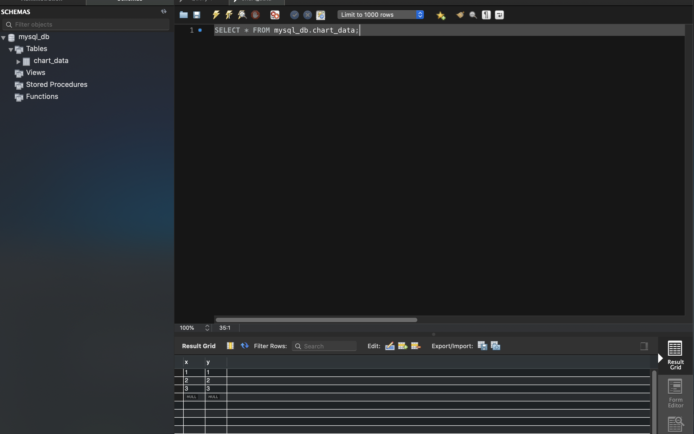

# Docker MySQL Python3 Starter

A beginner docker-compose configuration for building two docker containers.

One container has a simple python script (`insert.py`) that inserts data into a second container with MySQL database instance running.

# Pre-requisites

- Docker
- Docker compose

# Setup

1. Run `docker-compose up` from root project directory
2. Data should be inserted into the docker MySQL database (port 3306):

   

3. Clean up by running:

```
> docker-compose down -v

Removing docker-compose-mysql-python3-starter_app_1 ... done
Removing docker-compose-mysql-python3-starter_db_1  ... done
Removing network docker-compose-mysql-python3-starter_default
Removing volume docker-compose-mysql-python3-starter_mysql_data
```
